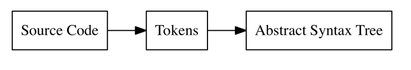

## BigTalk is a basic functional programming language

Here's how it looks like
```javascript
let name = "John Doe";
let age = 20;
let languages = ["English", "French", "Spanish", "Dutch"];
let music = {
    "title": "Cleaning out my closet",
    "artist": "Eminem",
};

let printMusic = fn(mus) {
    let title = mus["title"];
    let artist = mus["artist"];
    print(title + " - " + artist);
};

printMusic(music);
// => prints: "Cleaning out my closet - Eminem"

let map = fn(arr, f) {
    let iter = fn(arr, accumulated) {
        if (len(arr) == 0) {
            accumulated
        } else {
            iter(rest(arr), push(accumulated, f(first(arr))));
        }
    };
    iter(arr, []);
};

let fibonacci = fn(x) {
    if (x == 0) {
        0
    } else {
        if (x == 1) {
            return 1;
        } else {
            fibonacci(x - 1) + fibonacci(x - 2);
        }
    }
};

let numbers = [1, 1 + 1, 4 - 1, 2 * 2, 2 + 3, 12 / 2];
map(numbers, fibonacci);
// => returns: [1, 1, 2, 3, 5, 8]
```

### BigTalk supports the following:
* Integers
* Booleans
* Strings
* Arrays
* Maps
* Prefix & Infix expressions
* Index operators
* If statements
* Return statements
* First-class functions
* Global and local binding
* Closures

#### BigTalk consists an Interpreter/Evaluator, a Compiler and a Virtual Machine
It has the following major parts:
* The Lexer
* The Parser
* The Abstract Syntax Tree (AST)
* The internal object system
* The Evaluator
* Compiler
* Virtual Machine (VM)



The BigTalk interpreter is a tree-walking interpreter (like LISP) which tokenizes and parses the BigTalk source code in the 
REPL, builds up an internal representation of the code called an Abstract Syntax Tree(AST) and then evaluates this tree to produce result.

The BigTalk compiler takes the AST and translates it onto bytecode instructions for the VM. The VM then fetches the bytecode
instructions, decodes it and executes them continuously this is called the fetch-decode-execute cycle. The BigTalk VM is a
stack machine because it only makes use of a stack to manage data.

### TODO
* Better error handling with line numbers
* Floating point numbers support
* Macros

### TEST
```bash
go test -v ./...
```

### RESOURCES
* [Douglas Crockford - Top Down Operator Precedence](http://javascript.crockford.com/tdop/tdop.html)
* [Bob Nystrom - Pratt Parsers: Expression Parsing Made Easy](https://journal.stuffwithstuff.com/2011/03/19/pratt-parsers-expression-parsing-made-easy/)
* [Lexical Scanning in Go - Rob Pike](https://www.youtube.com/watch?v=HxaD_trXwRE)
* [Peter Norvig - How to Write a Lisp Interpreter in Python](http://norvig.com/lispy.html)
* [Otto - A JavaScript Interpreter In Go](https://github.com/robertkrimen/otto)
* [Jack W. Crenshaw - Let’s Build a Compiler!](https://compilers.iecc.com/crenshaw/tutorfinal.pdf)
* [Matt Might - Closure Conversion](https://matt.might.net/articles/closure-conversion/)
* [Vyacheslav Egorov - Explaining JavaScript VMs in JavaScript](https://mrale.ph/blog/2012/06/03/explaining-js-vms-in-js-inline-caches.html)
* [chibicc: A Small C Compiler](https://github.com/rui314/chibicc)
